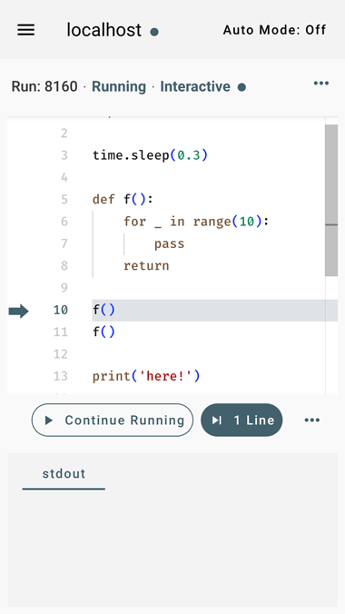

# nextline-web

[](https://www.npmjs.com/package/nextline-web)
[](https://github.com/simonsobs/nextline-web/actions/workflows/unit-test.yml)
[](https://github.com/simonsobs/nextline-web/actions/workflows/type-check.yml)

_Web frontend for Nextline._

Nextline lets multiple users execute concurrent Python scripts line by line
remotely from the browser.

The backend API is provided by separate packages (e.g.,
[nextline-graphql](https://pypi.org/project/nextline-graphql)).

## Screenshot



## How to run the Nextline frontend web app

The section shows how to run the Nextline frontend web app. To start, you need
to know the URL of the [backend API
server](https://github.com/nextline-dev/nextline-graphql).

### As a Docker container

Docker images of the Nextline frontend web app are created as
[ghcr.io/simonsobs/nextline-web](https://github.com/simonsobs/nextline-web/pkgs/container/nextline-web).

#### Environment variables in the container

You can configure the web app in the container with these variables.

| Environment variable | Default value           | Description                                |
| -------------------- | ----------------------- | ------------------------------------------ |
| `PUBLIC_PATH`        | `/`                     | Path in the URL of the web app             |
| `API_HTTP`           | `http://localhost:8000` | URL of the GraphQL API server              |
| `API_NAME`           | `localhost`             | Text to be shown as part of the title      |
| `SEED_COLOR`         | `#607D8B`               | The source color (hex) of dynamic colors\* |

\*Accessible colors in light and dark modes are dynamically generated by
[Dynamic Color in Material Design](https://m3.material.io/styles/color/).

For example, if you are to run the web app at the port `8080` with the path
`/nextline/` and use the GraphQL API server at `http://localhost:5000/graphql` as the name `API 1`, you can do so with the following command.

```bash
docker run -p 8080:80 -e PUBLIC_PATH=/nextline/ -e API_HTTP=http://localhost:5000/graphql -e API_NAME="API 1" ghcr.io/simonsobs/nextline-web
```

If you are on the `localhost`, the web app is running at <http://localhost:8080/nextline/>.
